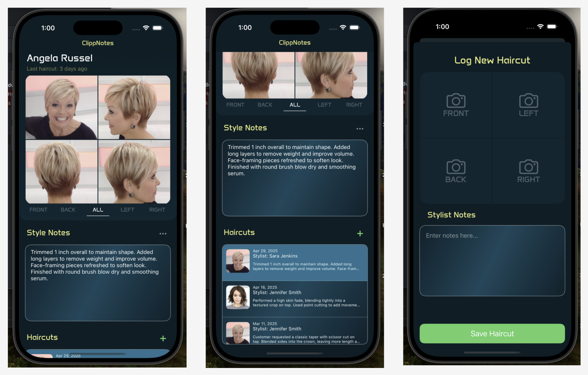

# 💇‍♀️ ClippNotes

> **An elegant, image-based client haircut logging app built with SwiftUI + AWS Amplify.**  
> *A portfolio-ready project built for stylists and salons to keep track of client styles visually.*

---

### 📲 Overview

**ClippNotes** is a modern, stylist-focused iOS app that allows salon professionals to:

- 📸 Capture client haircut photos from all key angles  
- 📝 Add stylist notes to each haircut entry  
- 🧾 Maintain a chronological history of all haircuts per client  
- 💾 Store and retrieve data using AWS S3 and GraphQL APIs  
- 🧭 Navigate a clean, tab-based UI with swipe gestures for photo viewing

This app was built to enhance the professionalism and record-keeping abilities of salons through intuitive, image-driven documentation.

---

### 🛠 Technologies

- **SwiftUI** for building a declarative UI  
- **AWS Amplify (S3 + GraphQL API)** for data and media management  

---

### ✂️ Core Features

- **🧑‍🤝‍🧑 Client Profiles**: Create and manage customer records  
- **📷 Multi-Angle Haircut Logging**: Capture front, back, left, and right views  
- **📓 Stylist Notes**: Add and persist detailed descriptions of each cut  
- **📅 Haircut History**: Easily reference past haircuts for repeat visits  
- **☁️ Cloud Sync**: Upload and retrieve media reliably via AWS S3  

---

### 🖼 UI Design

🎨 Clean, Visual, and Purpose-Built
The ClippNotes interface is designed specifically for hair salon professionals, emphasizing visual clarity, intuitive navigation, and effortless documentation.

I used [Figma](https://figma.com) to prototype the entire experience:



- Font: **Anta** (custom Google Font)  
- Primary Color Palette: Soft blues + pastel yellows  

---

### 🚧 Future Enhancements

Ideas for upcoming releases:

- ✅ Design and build customer profile screen  
- ✅ Enhanced image alignment UI with overlays  
- ✅ Tagging and overlaying notes to specific image areas 
- ✅ Deep linking and calendar reminders for return visits  
- ✅ Haircut templates and style tagging  

---

### 📦 Getting Started

To run locally:

```bash
git clone https://github.com/vincemuller/ClippNotes.git
open ClippNotes.xcodeproj
